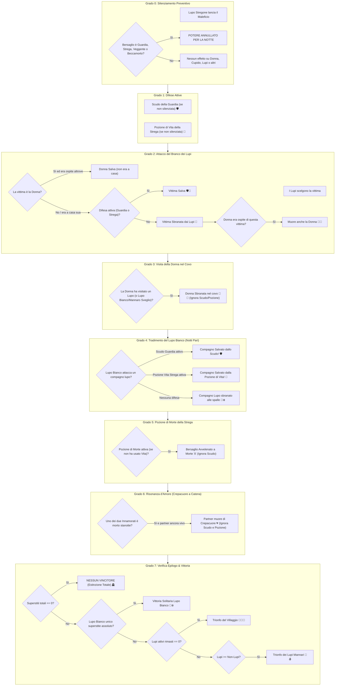

# 📜 Lupus in Fabula: Report Ufficiale delle Meccaniche di Gioco, Ruoli & Matrice dei Poteri

Questo documento costituisce il registro ufficiale, esaustivo e definitivo di tutti i ruoli, delle regole di gioco, delle condizioni particolari, dell'ordine rigoroso di priorità e della gestione di tutti i casi limite implementati nel motore di gioco di *Lupus in Fabula*.

---

## 1. Schede Dettagliate di Tutti i Ruoli (14 Ruoli Ufficiali)

### 1. 🐺 Lupo (Base)
* **Fazione:** Branco dei Lupi 🐺 (`faction: "lupi"`, Colore: `#ff2a5f`)
* **Descrizione & Azione Notturna:** Ogni notte si sveglia con tutti gli altri membri del branco per concordare silenziosamente e indicare al Narratore una vittima da sbranare.
* **Meccanica nel Motore:** La vittima designata viene registrata in `nightActions.wolfTarget` e risolta all'Alba nel Grado 2.
* **Condizioni Particolari & Casi Limite:**
  * Se attacca la **Donna** ed essa ha trascorso la notte da un innocente, la casa è vuota e l'attacco fallisce.
  * Se la vittima è difesa dallo **Scudo della Guardia** o sanata dalla **Pozione di Vita della Strega**, l'attacco fallisce.
  * Se un Lupo è legato come **Innamorato** da Cupido e l'amato muore, il Lupo muore all'istante di crepacuore.
  * A notti alterne (notti pari), i lupi del branco possono essere traditi e sbranati alle spalle dal **Lupo Bianco**.

### 2. 🔮 Veggente
* **Fazione:** Villaggio 🔮 (`faction: "villaggio"`, Colore: `#a855f7`)
* **Descrizione & Azione Notturna:** Ogni notte indica al Narratore un abitante vivo per scoprire se appartiene al Branco dei Lupi oppure agli innocenti.
* **Meccanica nel Motore:** Il Narratore seleziona il giocatore (`nightActions.seerTarget`); il sistema genera istantaneamente il responso su schermo: **LUPO** oppure **NON LUPO**.
* **Condizioni Particolari & Casi Limite:**
  * **Auto-scrutinio vietato:** Non può interrogare se stesso.
  * **Falso Positivo:** Se scruta l'**Idiota del Villaggio**, il responso è falsamente **LUPO**.
  * **Falso Negativo:** Se scruta il **Cane Nero** o l'**Infiltrato non ancora trasformato**, il responso è falsamente **NON LUPO**.
  * **Silenziamento:** Se bersagliato dal **Lupo Stregone**, la vista mistica è oscurata e non può scrutare per quella notte.

### 3. 🛡️ Guardia
* **Fazione:** Villaggio 🛡️ (`faction: "villaggio"`, Colore: `#3b82f6`)
* **Descrizione & Azione Notturna:** Ogni notte indica un giocatore da proteggere con il suo scudo indistruttibile contro gli assalti dei lupi.
* **Meccanica nel Motore:** Registrato in `nightActions.guardTarget`. Ha priorità di intercettazione al Grado 1.
* **Condizioni Particolari & Casi Limite:**
  * **Autoprotezione:** Può scegliere di proteggere **se stessa**.
  * **Protezione Universale vs Lupi:** Difende sia dall'attacco del **Branco** sia dal tradimento del **Lupo Bianco**.
  * **Protezione Involontaria di un Lupo:** Se protegge un lupo e il Lupo Bianco tenta di sbranarlo alle spalle, lo scudo salva il lupo tradito.
  * **Inefficace contro la Pozione di Morte:** Non para il veleno magico della Strega.
  * **Inefficace contro il Crepacuore:** Non ferma la morte per crepacuore degli Innamorati.
  * **Inefficace sulla Donna nel Covo:** Non salva la Donna se questa visita un Lupo.
  * **Silenziamento:** Se silenziata dal Lupo Stregone, lo scudo viene completamente disattivato per quella notte.

### 4. 🧙‍♀️ Strega
* **Fazione:** Villaggio 🧙‍♀️ (`faction: "villaggio"`, Colore: `#10b981`)
* **Descrizione & Azione Notturna:** Dispone di 2 pozioni monouso per tutta la partita: la **Pozione di Vita** per salvare chiunque e la **Pozione di Morte** per avvelenare un sospettato. Può usare **al massimo UNA pozione a notte**.
* **Meccanica nel Motore:** 
  * `witchLifeUsed` e `witchDeathUsed` persistono per l'intera partita.
  * L'attivazione di una pozione disabilita automaticamente l'altra per quel round (mutua esclusione).
* **Condizioni Particolari & Casi Limite:**
  * **Pozione di Vita su se stessa:** La Strega può curare e salvare se stessa se attaccata dai lupi.
  * **Divieto di Suicidio:** L'interfaccia esclude la Strega dalla lista dei bersagli della Pozione di Morte.
  * **Pozione di Vita vs Crepacuore:** Non ha alcun potere di risanare il crepacuore d'amore.
  * **Benedizione a vuoto:** Usare la Pozione di Vita su chi non è sotto attacco consuma la pozione senza effetti.
  * **Precedenza Scudo:** Se sia la Guardia che la Strega proteggono la stessa vittima, lo scudo para per primo ma la pozione viene comunque consumata.
  * **Silenziamento:** Se silenziata dal Lupo Stregone, entrambe le pozioni sono bloccate per la notte.

### 5. 💘 Cupido
* **Fazione:** Villaggio 💘 (`faction: "villaggio"`, Colore: `#f43f5e`)
* **Descrizione & Azione Notturna:** Agisce **SOLO durante la Notte 1**. Sceglie due giocatori e li lega per sempre come Innamorati.
* **Meccanica nel Motore:** I due ID vengono registrati in `game.lovers`. Se uno dei due muore in qualsiasi momento (notte o giorno), l'altro muore all'istante di crepacuore (`Grado 6` di notte, o all'atto del rogo di giorno).
* **Condizioni Particolari & Casi Limite:**
  * **Autoscelta:** Cupido può legare se stesso con un altro giocatore.
  * **Nessuna condizione di vittoria della coppia:** Gli Innamorati appartengono alle rispettive fazioni originarie.
  * **Innamorati che muoiono insieme per cause diverse:** Se in una stessa notte uno muore per i lupi e l'altro per veleno, muoiono per le rispettive cause senza generare crepacuori ridondanti.
  * **Immune al Lupo Stregone:** Cupido agisce solo nella Notte 1 e prima dello Stregone; non è silenziabile.

### 6. 💃 La Donna (Meretrice)
* **Fazione:** Villaggio 💃 (`faction: "villaggio"`, Colore: `#ec4899`)
* **Descrizione & Azione Notturna:** Ogni notte sceglie dove rifugiarsi: può visitare un altro abitante o restare "A Casa Sua".
* **Meccanica nel Motore:** `nightActions.donnaTarget`. La sua assenza la protegge a casa sua, ma la espone nella dimora dell'ospite.
* **Condizioni Particolari & Casi Limite:**
  * **Visita a un Lupo:** Se visita un Lupo (normale, Stregone, Cane Nero, Lupo Bianco o Mannaro trasformato), muore sbranata nel covo (Grado 3). Nessun scudo o pozione di vita può salvarla.
  * **I Lupi attaccano la Donna a casa sua:** Se era rifugiata da un innocente, è salva (la casa era vuota). Se era a casa sua, viene sbranata.
  * **I Lupi attaccano l'ospite:** Se l'ospite muore sbranato, muore anche la Donna. Se l'ospite è difeso da Guardia o curato da Strega, si salvano entrambi.
  * **Guardia su Donna, ma Lupi sull'Ospite:** La Donna muore comunque con l'ospite (l'incursione è avvenuta a casa dell'ospite non protetto).
  * **Ospite che muore di Veleno o Crepacuore:** La Donna sopravvive (non c'è stato assalto fisico nella stanza).
  * **Donna avvelenata dalla Strega:** Muore ovunque si trovi (il veleno segue la persona).
  * **Donna innamorata di un Lupo che visita il partner:** La Donna muore sbranata nel covo e il compagno lupo muore di crepacuore all'Alba.

### 7. 👨‍🌾 Contadino
* **Fazione:** Villaggio 👨‍🌾 (`faction: "villaggio"`, Colore: `#eab308`)
* **Descrizione & Azione Notturna:** Non ha abilità notturne. Dorme tutta la notte. La sua forza è la deduzione e il voto al rogo.
* **Condizioni Particolari:** Bersaglio standard per lupi, veleni e frecce di Cupido.

### 8. 🃏 Il Giullare
* **Fazione:** Fazione Solitaria 🃏 (`faction: "solitario"`, Colore: `#f59e0b`)
* **Descrizione & Obiettivo:** Generatore di caos neutrale. Non appartiene a nessuna fazione e **vince da solo se e solo se viene condannato al ROGO dal villaggio**.
* **Condizioni Particolari & Casi Limite:**
  * **Morte Notturna:** Se sbranato o avvelenato di notte, muore ed è eliminato definitivamente senza vincere.
  * **Giullare Innamorato al Rogo:** Se il Giullare viene condannato al rogo, vince all'istante la partita.
  * **Partner del Giullare al Rogo:** Se viene condannato il partner e il Giullare muore di crepacuore, **il Giullare NON vince** (è morto per legame amoroso, non per condanna diretta del villaggio).

### 9. 🐺🌕 Lupo Mannaro (Infiltrato)
* **Fazione:** Branco dei Lupi 🐺🌕 (`faction: "lupi"`, Colore: `#ef4444`)
* **Descrizione & Azione Notturna:** Umano portatore di licantropia latente. Finché è latente, dorme con gli umani e non si sveglia con i lupi. Ogni notte viene tirato il dado della Luna Piena (Notte 1: 10%, +8% a notte, max 45%). Se la luna è piena, si trasforma permanentemente in Lupo del branco.
* **Condizioni Particolari & Casi Limite:**
  * **Stato Latente (Prima della trasformazione):**
    * Al **Veggente** appare come **NON LUPO**.
    * Al **Beccamorto** (se muore da latente) appare con la **copertura da CONTADINO** (Opzione B Ufficiale).
    * Se la **Donna** lo visita, è al sicuro.
    * Se tutti i lupi attivi muoiono e lui è ancora latente, **il Villaggio vince subito**.
  * **Stato Trasformato (Dopo la Luna Piena):**
    * Si sveglia con il branco dalla notte stessa.
    * Al **Veggente** e al **Beccamorto** appare come **LUPO / Lupo Mannaro**.
    * Se la **Donna** lo visita, muore sbranata.
    * La trasformazione è irreversibile per il resto della partita.

### 10. 🐺❄️ Il Lupo Bianco
* **Fazione:** Fazione Solitaria 🐺❄️ (`faction: "solitario"`, Colore: `#38bdf8`)
* **Descrizione & Azione Notturna:** Finge alleanza con il branco e si sveglia con loro ogni notte per scegliere la vittima del villaggio. A notti alterne (notti pari: 2, 4, 6...), però, si sveglia una seconda volta da solo e può sbranare uno degli altri lupi del branco.
* **Condizione di Vittoria Solitaria:** Vince da solo **SOLO ed ESCLUSIVAMENTE se è l'ultimo e unico superstite assoluto della partita ($N_{vivi} == 1$)**.
* **Condizioni Particolari & Casi Limite:**
  * **Bersagli Consentiti:** Può tradire solo i lupi del branco originario (`lupo`, `lupo_stregone`, `cane_nero`).
  * **Immune al Silenziamento:** Il Lupo Stregone non può silenziare la sua azione solitaria a notti pari.
  * **Scudo e Pozione di Vita:** Il morso traditore alle spalle del Lupo Bianco può essere intercettato sia dallo Scudo della Guardia che dalla Pozione di Vita della Strega.
  * **Parità Lupi vs Umani:** Se rimangono 1 Lupo Bianco + 1 Lupo del Branco + 2 Cittadini, scatta la vittoria della fazione Lupi, vanificando la vittoria solitaria del Lupo Bianco.

### 11. 🐺🔮 Il Lupo Stregone
* **Fazione:** Branco dei Lupi 🐺🔮 (`faction: "lupi"`, Colore: `#9333ea`)
* **Descrizione & Azione Notturna:** Si sveglia con i lupi per sbranare la vittima. Subito dopo, si sveglia da solo e lancia il suo maleficio indicando un abitante per annullarne il potere notturno per la notte in corso.
* **Condizioni Particolari & Casi Limite:**
  * **Bersagli Bloccabili:** Ha effetto solo su **Guardia** (scudo annullato), **Strega** (pozioni bloccate), **Veggente** (vista oscurata) e **Beccamorto** (spiriti silenti).
  * **Bersagli Immuni:** Donna, Cupido, Contadino, Idiota, Giullare, Lupo Bianco, Infiltrato e compagni lupi non subiscono blocchi.
  * **Silenziamento del bersaglio dei Lupi:** Se silenzia la Guardia o la Strega e contemporaneamente i lupi le attaccano, esse non possono proteggersi o curarsi e muoiono sbranate.

### 12. ⚰️ Il Beccamorto
* **Fazione:** Villaggio ⚰️ (`faction: "villaggio"`, Colore: `#64748b`)
* **Descrizione & Azione Notturna:** Attivo **dalla Notte 2 in poi**. Nel silenzio del cimitero, il Narratore gli rivela segretamente l'identità di un defunto.
* **Condizioni Particolari & Casi Limite:**
  * **1 Sola Identità per Round:** Se nel cimitero o nel round precedente ci sono più morti (es. rogo + innamorato per crepacuore, o sbranato + avvelenato), il Beccamorto sceglie **un solo defunto** da consultare per notte. Gli altri rimangono coperti per le notti successive.
  * **Copertura Infiltrato Latente (Opzione B):** Se l'Infiltrato è morto prima di trasformarsi, al Beccamorto appare falsamente come **Contadino (Villaggio 👨‍🌾)**.
  * **Infiltrato Trasformato:** Appare come **Lupo Mannaro (Branco dei Lupi 🐺🌕)**.
  * **Verità su Cane Nero & Idiota:** Al Beccamorto non mentono: il Cane Nero appare come **Lupo**, e l'Idiota appare come **Innocente**.
  * **Silenziamento:** Se silenziato dal Lupo Stregone, per quella notte i morti tacciono.

### 13. 🤡 L'Idiota del Villaggio
* **Fazione:** Villaggio 🤡 (`faction: "villaggio"`, Colore: `#14b8a6`)
* **Descrizione:** Membro innocente del villaggio. Non ha poteri notturni. Le sue stranezze e follie ingannano la vista mistica del Veggente.
* **Condizioni Particolari & Casi Limite:**
  * **Falso Positivo per il Veggente:** Quando il Veggente lo scruta, il Narratore deve obbligatoriamente rispondere che è un **LUPO**.
  * **Verità al Beccamorto:** Se muore e viene consultato dal Beccamorto, viene rivelato come innocente Idiota del Villaggio.
  * **Nessuna immunità al Rogo:** In questa versione ufficiale del gioco, l'Idiota non possiede vite extra al rogo: se votato dalla maggioranza, viene bruciato ed eliminato come ogni altro abitante.

### 14. 🐕‍🦺 Il Cane Nero (Lupo Illusionista)
* **Fazione:** Branco dei Lupi 🐕‍🦺 (`faction: "lupi"`, Colore: `#dc2626`)
* **Descrizione & Azione Notturna:** Un vero Lupo Mannaro sotto le sembianze di un fedele segugio nero. Si sveglia ogni notte con il branco per scegliere la vittima.
* **Condizioni Particolari & Casi Limite:**
  * **Falso Negativo per il Veggente:** La sua aura inganna il Veggente: se scrutato, il Narratore risponde che è **NON LUPO**.
  * **Verità al Beccamorto:** Quando muore, il Beccamorto scopre la sua vera natura di Cane Nero del Branco dei Lupi.
  * **Conteggio di Fazione:** Conta a tutti gli effetti come Lupo per le condizioni di vittoria del Villaggio o dei Lupi.

---

## 2. Regolamento Ufficiale delle Condizioni Particolari & Paradossi

### 1. Pozione di Vita della Strega: Salva Sempre dalle Aggressioni Fisiche 🧪
* Salva universalmente dall'attacco del **Branco dei Lupi** e dal tradimento del **Lupo Bianco**.
* Può essere usata dalla Strega per **salvare se stessa**.
* Se usata su chi è protetto dalla Guardia, la Guardia ha la precedenza e la pozione viene comunque consumata.
* Se usata su chi non è in pericolo, viene consumata a vuoto.
* **NON salva dal Crepacuore d'amore** e **NON salva la Donna** se questa entra nella tana di un lupo.

### 2. Guardia & Strega vs Crepacuore d'Amore: L'Innamorato muore comunque 💔
* Il legame spirituale scoccato da Cupido ignora scudi fisici e pozioni alchemiche.
* Se un Innamorato muore (per lupi, lupo bianco, veleno o rogo), il partner muore all'istante di crepacuore, anche se era protetto dallo Scudo della Guardia o destinatario della Pozione di Vita.

### 3. La Donna (Meretrice): Rifugio, Trappole e Sovrapposizioni Difensive 💃
* **Pozione di Morte su Donna:** La Donna muore avvelenata anche se non è a casa sua (il veleno colpisce la persona ovunque si trovi).
* **Ospite Sbranato:** Se l'ospite viene sbranato dai lupi, muore anche la Donna.
* **Ospite Difeso:** Se l'ospite è difeso da Guardia o Pozione di Vita, sia l'Ospite che la Donna sopravvivono.
* **Guardia su Donna, ma Lupi su Ospite:** La Donna muore comunque insieme all'ospite (l'irruzione mortale è avvenuta a casa dell'ospite).
* **Ospite Avvelenato o Morto di Crepacuore:** La Donna sopravvive (non c'è stato assalto di lupi nella stanza).
* **Visita al Covo del Lupo:** Se visita un Lupo (o Lupo Bianco o Mannaro trasformato), la Donna muore sbranata. Scudo e Pozione di Vita non possono fermare un'intrusione mortale nel covo.

### 4. Il Beccamorto: 1 Sola Identità a Round & Copertura Infiltrato (Opzione B Ufficiale) ⚰️
* Dalla Notte 2 in poi, il Beccamorto può interrogare **un solo defunto alla volta per ciascun round**.
* Se ci sono più morti nel cimitero, ne sceglie uno solo; gli altri restano segreti e consultabili nei round successivi.
* **Regola di Copertura (Opzione B):**
  * Se l'Infiltrato muore **prima** di trasformarsi, al Beccamorto appare con la copertura da **Contadino (Villaggio 👨‍🌾)**.
  * Se muore **dopo** la trasformazione, appare come **Lupo Mannaro (Branco dei Lupi 🐺🌕)**.
  * Cane Nero e Idiota del Villaggio rivelano invece sempre la loro vera natura di carta.

### 5. Il Giullare: Rogo vs Crepacuore vs Morte Notturna 🃏
* Vince da solo se e solo se condannato al **Rogo diurno**.
* Se ucciso di notte, muore ed è eliminato senza vincere.
* Se è innamorato e il villaggio brucia il suo partner, il Giullare muore di crepacuore e **NON vince**.

### 6. Paradosso della Coppia Mista rimasta sola (Lupo + Cittadino) ⏳
* Non esiste condizione di vittoria esclusiva della coppia.
* Se rimangono vivi solo 1 Lupo e 1 Cittadino innamorati, per formula numerica ($Lupi \ge NonLupi$) scatta la vittoria della **Fazione Lupi**.

### 7. Estinzione Totale (0 Superstiti): Scenario "Nessuno Vince" 🪦
* Se all'Alba o al Rogo (es. 2 innamorati rimasti soli di cui uno viene bruciato e l'altro muore di crepacuore) non resta alcun giocatore vivo ($N_{vivi} = 0$), non c'è vittoria del Villaggio né dei Lupi.
* Viene proclamato ufficialmente: **Nessun Vincitore (Estinzione Totale)**.

---

## 3. Ordine di Risoluzione & Gerarchia delle Priorità

### A. Sequenza Cronologica di Risveglio Notturno (Interfaccia Narratore)
1. **Calano le Tenebre (Intro):** Il villaggio si addormenta.
2. **Cupido (Solo Notte 1):** Lega i due Innamorati.
3. **La Donna:** Sceglie da chi rifugiarsi o se restare a casa sua.
4. **Luna Piena del Lupo Mannaro (Infiltrato):** Se latente, si lancia il dado. Se si trasforma, diventa lupo e si sveglierà con il branco nel passaggio successivo!
5. **Branco dei Lupi:** Si svegliano tutti i lupi (normali, Lupo Stregone, Cane Nero, Lupo Bianco e Lupo Mannaro se trasformato) e scelgono la vittima.
6. **Lupo Stregone:** Si sveglia da solo e silenzia un giocatore.
7. **Lupo Bianco (Solo Notti Pari 2, 4, 6...):** Si sveglia da solo e può sbranare a tradimento un compagno lupo.
8. **La Guardia:** Indica chi proteggere con lo scudo (se silenziata, il potere è disabilitato).
9. **Il Veggente:** Indica chi scrutare (se silenziato, vista oscurata).
10. **Il Beccamorto (Dalla Notte 2 in poi):** Sceglie un solo defunto da interrogare (se silenziato, i morti tacciono).
11. **La Strega:** Vede la vittima dei lupi e sceglie se usare Pozione di Vita o di Morte (max 1 pozione per notte; disabilitata se silenziata).
12. **Alba (Risveglio del Villaggio):** Il motore esegue il calcolo algoritmico gerarchico.

---

### B. Diagramma di Flusso Algoritmico all'Alba (`LupusNightResolver`)

---

## 4. Matrice Completa degli Scontri Diretti ("Chi Vince?")

| Scontro Diretto | Potere / Azione A | Potere / Azione B | Chi Prevale? | Esito Ufficiale nel Motore di Gioco |
| :--- | :--- | :--- | :---: | :--- |
| **Strega (Vita) vs Lupi del Branco** | Pozione Vita | Attacco Branco | **Strega** 🧪 | Bersaglio **Salvo**. Pozione consumata. |
| **Strega (Vita) vs Lupo Bianco** | Pozione Vita | Morso Traditore | **Strega** 🧪 | Bersaglio **Salvo**. Pozione consumata. |
| **Strega (Vita) su se stessa** | Pozione Vita | Attacco Lupi | **Strega** 🧪 | Strega **Salva** dall'attacco alla propria persona. |
| **Strega (Vita) vs Crepacuore** | Pozione Vita | Crepacuore | **Crepacuore** 💔 | L'innamorato **Muore**. La pozione non risana il cuore spezzato. |
| **Strega (Vita) su bersaglio incolume**| Pozione Vita | Nessun Attacco | **Spreco** 💨 | Pozione **consumata a vuoto** per il resto della partita. |
| **Strega (Vita) vs Strega (Morte)** | Pozione Vita | Pozione Morte | **Mutua Esclusione** ⚖️ | **Impossibile nello stesso turno** (massimo 1 pozione a notte). |
| **Guardia vs Lupi del Branco** | Scudo Guardia | Attacco Branco | **Guardia** 🛡️ | Bersaglio **Salvo**. Nessun caduto tra i contadini. |
| **Guardia protegge se stessa** | Scudo Guardia | Attacco Branco | **Guardia** 🛡️ | Guardia **Salva**. L'autoprotezione è consentita. |
| **Guardia vs Lupo Bianco** | Scudo Guardia | Morso alle Spalle | **Guardia** 🛡️ | **Salvo!** Lo scudo difende il compagno lupo dal tradimento. |
| **Guardia vs Strega (Morte)** | Scudo Guardia | Pozione Morte | **Strega** ☠️ | Bersaglio **Muore avvelenato**. Lo scudo ferma solo zanne fisiche. |
| **Guardia vs Crepacuore Innamorati** | Scudo Guardia | Crepacuore | **Crepacuore** 💔 | L'innamorato **Muore comunque**. Trapassa qualsiasi scudo. |
| **Guardia + Strega (Vita) su stessa vittima** | Scudo Guardia | Pozione Vita | **Guardia** 🛡️ | Bersaglio Salvo; la Guardia para per prima, la Strega consuma la pozione. |
| **Lupi attaccano Donna a casa sua** | Attacco Lupi | Assenza da Casa | **Donna** 💃 | **Donna Salva** (se era rifugiata da un innocente). |
| **Donna resta a casa sua e viene attaccata** | Assalto Lupi | Donna a Casa | **Lupi** 🐺 | **Donna Sbranata** (vulnerabile come un normale cittadino). |
| **Strega (Morte) vs Donna ospite altrove** | Pozione Morte | Assenza da Casa | **Strega** ☠️ | **Donna Muore avvelenata** (il veleno colpisce la persona ovunque sia). |
| **Donna visita un Lupo qualsiasi** | Rifugio Donna | Presenza Lupo | **Lupi** 🐺 | **Donna Muore sbranata** nella tana del Lupo. |
| **Donna visita il Lupo Bianco** | Rifugio Donna | Lupo Bianco | **Lupo Bianco** 🐺❄️ | **Donna Muore sbranata** nella dimora del Lupo Bianco. |
| **Donna visita Mannaro non trasformato** | Rifugio Donna | Mannaro Latente | **Donna** 💃 | **Donna Salva**. Dorme sonni tranquilli. |
| **Donna visita Mannaro trasformato** | Rifugio Donna | Mannaro Sveglio | **Lupi** 🐺 | **Donna Muore sbranata**. |
| **Guardia protegge Donna che visita un Lupo** | Scudo Guardia | Tana del Lupo | **Lupo** 🐺 | **Donna Muore sbranata**. Lo scudo non difende da intrusioni suicide. |
| **Strega (Vita) su Donna che visita un Lupo** | Pozione Vita | Tana del Lupo | **Lupo** 🐺 | **Donna Muore sbranata** e la pozione va sprecata. |
| **Lupi attaccano ospite della Donna** | Attacco Lupi | Rifugio Donna | **Lupi** 🐺 | **Muoiono sia l'Ospite che la Donna**. |
| **Lupi attaccano ospite difeso da Guardia** | Scudo Guardia | Attacco Lupi | **Guardia** 🛡️ | **Salvi sia l'Ospite che la Donna**. |
| **Lupi attaccano ospite curato da Strega** | Pozione Vita | Attacco Lupi | **Strega** 🧪 | **Salvi sia l'Ospite che la Donna**. |
| **Guardia su Donna, ma Lupi attaccano Ospite** | Scudo su Donna | Assalto su Ospite | **Lupi** 🐺 | **Muoiono sia l'Ospite che la Donna** (l'assalto è avvenuto a casa dell'ospite). |
| **Ospite muore di Crepacuore o Veleno** | Crepacuore / Veleno | Rifugio Donna | **Donna** 💃 | **La Donna Sopravvive**. Nessun lupo ha fatto irruzione nella stanza. |
| **Donna visita il proprio Innamorato Lupo** | Rifugio Donna | Crepacuore Lupo | **Doppia Morte** 💃💔 | Donna sbranata nel covo; il Lupo muore di crepacuore all'Alba. |
| **Lupo Stregone vs Guardia / Strega** | Silenziamento | Scudo / Pozioni | **Lupo Stregone** 🔮 | Potere **bloccato** per l'intera notte. Difese e veleni annullati. |
| **Lupo Stregone vs Veggente / Beccamorto**| Silenziamento | Visione / Spiriti | **Lupo Stregone** 🔮 | Vista e consulto **oscurati** per quella notte. |
| **Lupo Stregone vs Lupo Bianco** | Silenziamento | Morso Traditore | **Lupo Bianco** 🐺❄️ | Nessun effetto. Il Lupo Bianco è **immune** al silenzio. |
| **Lupo Stregone vs Donna / Cupido** | Silenziamento | Rifugio / Frecce | **Innocenti** 💃💘 | Nessun effetto. Non hanno poteri bloccabili dallo Stregone. |
| **Lupo Stregone silenzia Guardia/Strega sotto attacco** | Silenziamento + Lupi | Difesa Personale | **Lupi** 🐺 | Bersaglio **Sbranato**: non può proteggere se stesso. |
| **Beccamorto con morti multiple** | Consulto Spiriti | Cimitero Multiplo | **1 Sola Identità** ⚰️ | Il Beccamorto sceglie e apprende **un solo ruolo a notte**. |
| **Beccamorto vs Lupo Mannaro Latente** | Consulto Spiriti | Mannaro Non Trasformato | **Copertura** 👨‍🌾 | Rivelato come **Contadino (Villaggio)**: licantropia non ancora attiva. |
| **Beccamorto vs Lupo Mannaro Trasformato**| Consulto Spiriti | Mannaro Sveglio | **Vero Ruolo** 🐺🌕 | Rivelato come **Lupo Mannaro (Branco dei Lupi)**. |
| **Beccamorto vs Cane Nero** | Consulto Spiriti | Mascheramento Segugio | **Vero Ruolo** 🐕‍🦺 | Rivelato come **Cane Nero (Branco dei Lupi)**. |
| **Beccamorto vs Idiota del Villaggio** | Consulto Spiriti | Follia Apparente | **Vero Ruolo** 🤡 | Rivelato come **Idiota del Villaggio (Villaggio)**. |
| **Giullare al Rogo (Giorno)** | Rogo Villaggio | Obiettivo Caos | **Giullare** 🃏 | **Partita vinta all'istante dal Giullare**. |
| **Giullare ucciso di Notte** | Attacco Notte | Giullare | **Attaccante** 🐺☠️ | Giullare **Eliminato** senza vincere. |
| **Partner del Giullare al Rogo** | Crepacuore | Giullare | **Morte Amore** 💔 | Il Giullare **Muore di crepacuore e NON vince** la partita. |
| **Entrambi Innamorati uccisi stanotte** | Lupi + Veleno | Coppia d'Amore | **Doppia Morte Diretta** | Ciascuno muore per la sua causa; nessun crepacuore ridondante. |
| **Estinzione Totale (0 superstiti vivi)** | Notte / Rogo | Sopravvivenza | **Nessuno** 🪦 | **Nessun Vincitore!** Villaggio deserto, pareggio per distruzione. |
| **Coppia Mista (Lupo + Umano) rimasta sola**| Vincolo Amoroso | Regole Fazione | **In Sospeso** ⏳ | Attualmente vittoria Lupi per formula numerica ($1 \ge 1$). |

---

## 5. Matrice Completa delle Visioni del Veggente 🔮

| Ruolo Scrutato | Fazione Reale | Responso Ufficiale del Narratore | Note Meccaniche e Falsi Positivi/Negativi |
| :--- | :---: | :---: | :--- |
| **Lupo** | Lupi | **LUPO 🐺** | Vero lupo predatore del branco |
| **Lupo Stregone** | Lupi | **LUPO 🐺** | Lupo con poteri oscuri |
| **Il Lupo Bianco** | Solitario | **LUPO 🐺** | Lupo mannaro solitario |
| **L'Idiota del Villaggio** | Villaggio | **LUPO 🐺** | ⚠️ **FALSO POSITIVO:** Innocente, ma le sue pazzie ingannano la vista mistica |
| **Lupo Mannaro (Trasformato)** | Lupi | **LUPO 🐺** | Licantropo risvegliato permanentemente dalla Luna Piena |
| **Il Cane Nero (Illusionista)** | Lupi | **NON LUPO 👤** | ⚠️ **FALSO NEGATIVO:** Feroce lupo travestito da innocuo cane da caccia |
| **Lupo Mannaro (Latente)** | Lupi | **NON LUPO 👤** | Umano finché non avviene la trasformazione con la Luna Piena |
| **Contadino** | Villaggio | **NON LUPO 👤** | Innocente senza poteri |
| **La Guardia** | Villaggio | **NON LUPO 👤** | Difensore del villaggio |
| **La Strega** | Villaggio | **NON LUPO 👤** | Alchimista benefica del villaggio |
| **Cupido** | Villaggio | **NON LUPO 👤** | Messaggero d'amore |
| **La Donna (Meretrice)** | Villaggio | **NON LUPO 👤** | Cittadina innocente |
| **Il Beccamorto** | Villaggio | **NON LUPO 👤** | Custode del cimitero |
| **Il Giullare** | Solitario | **NON LUPO 👤** | Abitante neutrale e caotico |
| **Veggente stesso** | Villaggio | *Non Selezionabile* | L'interfaccia esclude l'auto-scrutinio |

---

## 6. Matrice Completa dei Responsi del Beccamorto ⚰️

Il Beccamorto consulta gli spiriti dei defunti (massimo 1 a round dalla Notte 2 in poi):

| Ruolo del Defunto | Stato al Decesso | Carta Rivelata al Beccamorto | Spiegazione Meccanica |
| :--- | :---: | :---: | :--- |
| **Lupo** | Qualsiasi | **Lupo (Branco dei Lupi 🐺)** | Ruolo reale svelato |
| **Lupo Stregone** | Qualsiasi | **Lupo Stregone (Branco dei Lupi 🐺🔮)** | Ruolo reale svelato |
| **Lupo Bianco** | Qualsiasi | **Lupo Bianco (Fazione Solitaria 🐺❄️)** | Ruolo reale svelato |
| **Cane Nero (Illusionista)** | Qualsiasi | **Cane Nero (Branco dei Lupi 🐕‍🦺)** | L'illusione terrena cessa: appare come vero lupo |
| **L'Idiota del Villaggio** | Qualsiasi | **Idiota del Villaggio (Villaggio 🤡)** | La follia terrena cessa: appare come vero innocente |
| **Lupo Mannaro (Infiltrato)** | **Latente (Prima della Luna)** | **Contadino (Villaggio 👨‍🌾)** | ⚠️ **COPERTURA UMANA:** La licantropia non risvegliata resta sepolta |
| **Lupo Mannaro (Infiltrato)** | **Trasformato (Dopo la Luna)** | **Lupo Mannaro (Branco dei Lupi 🐺🌕)** | La licantropia risvegliata viene svelata |
| **Contadino** | Qualsiasi | **Contadino (Villaggio 👨‍🌾)** | Ruolo reale svelato |
| **La Guardia** | Qualsiasi | **Guardia (Villaggio 🛡️)** | Ruolo reale svelato |
| **La Strega** | Qualsiasi | **Strega (Villaggio 🧙‍♀️)** | Ruolo reale svelato |
| **Cupido** | Qualsiasi | **Cupido (Villaggio 💘)** | Ruolo reale svelato |
| **La Donna (Meretrice)** | Qualsiasi | **La Donna (Villaggio 💃)** | Ruolo reale svelato |
| **Il Giullare** | Qualsiasi | **Il Giullare (Fazione Solitaria 🃏)** | Ruolo reale svelato |

---

## 7. File Sorgente Collegati

- [lupus_night_resolver.js](file:///c:/Users/simop/Documents/GitHub/nuovoprogetto/js/games/lupus/lupus_night_resolver.js): Risoluzione notturna gerarchica all'Alba (Pozione Vita universale, scudo Guardia, trappole della Donna, crepacuore).
- [lupus_night_widgets.js](file:///c:/Users/simop/Documents/GitHub/nuovoprogetto/js/games/lupus/lupus_night_widgets.js): Interfaccia grafica con mutua esclusione pozioni Strega, selezione di 1 solo defunto per il Beccamorto (con copertura Infiltrato latente) e accoppiamento di Cupido.
- [lupus_master_ui.js](file:///c:/Users/simop/Documents/GitHub/nuovoprogetto/js/games/lupus/lupus_master_ui.js): Gestione del rogo diurno, crepacuore a catena, validazione passaggi ed epilogo a fine partita (compresi scenari Estinzione Totale e Giullare).
- [lupus_roles.js](file:///c:/Users/simop/Documents/GitHub/nuovoprogetto/js/games/lupus/lupus_roles.js): Definizioni canoniche delle 14 carte ruolo e configurazione della licantropia.
- [lupus_game.js](file:///c:/Users/simop/Documents/GitHub/nuovoprogetto/js/games/lupus_game.js): Controller di gioco e verifica condizioni di vittoria (Lupo Bianco, Villaggio, Lupi, Giullare e Nessun Vincitore).
