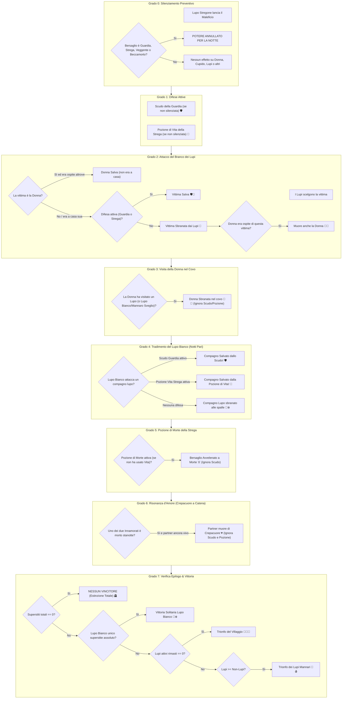

# 📜 Lupus in Fabula: Report Ufficiale delle Meccaniche di Gioco & Matrice dei Poteri

Questo documento costituisce il registro ufficiale e definitivo di tutte le regole, priorità di risoluzione notturna, interazioni tra poteri e gestione di tutti i casi limite implementati nel motore di gioco di *Lupus in Fabula*.

---

## 1. Regolamento Ufficiale Applicato sui Casi Limite

### 1. Pozione di Vita della Strega: Salva Sempre dalle Aggressioni Fisiche 🧪
* **Regola Ufficiale:** La Pozione di Vita della Strega è un elisir universale di salvezza contro qualsiasi aggressione fisica mortale notturna (zanne e artigli).
* **Esito nei casi limite:**
  * Se il bersaglio è attaccato dal **Branco dei Lupi** $\rightarrow$ **Salvo**.
  * Se il bersaglio (compagno lupo) viene attaccato alle spalle dal **Lupo Bianco** $\rightarrow$ **Salvo**.
  * Se la Strega somministra la Pozione di Vita a **se stessa** mentre è sotto attacco dei lupi $\rightarrow$ **Salva**.
* **Precedenza Scudo:** Se sia la Guardia che la Strega proteggono la stessa vittima, lo Scudo della Guardia ha la precedenza di intercettazione; la pozione della Strega viene comunque considerata consumata per la partita.
* **Benedizione a vuoto:** Se la Strega usa la Pozione di Vita su un giocatore che non è stato attaccato né dai Lupi né dal Lupo Bianco, la pozione viene sprecata e consumata per il resto della partita.
* **Limiti Magici:** La Pozione di Vita **NON salva dal Crepacuore degli Innamorati** né salva la Donna se questa entra volontariamente nella tana di un Lupo.

### 2. Guardia & Strega vs Crepacuore d'Amore: L'Innamorato muore comunque 💔
* **Regola Ufficiale:** Il legame spirituale scoccato da Cupido oltrepassa qualsiasi barriera fisica o pozione magica.
* **Esito:** Se un Innamorato perde la vita (di notte o al rogo diurno) e l'altro innamorato era protetto dallo Scudo della Guardia o destinatario della Pozione di Vita, **l'Innamorato protetto muore comunque all'istante di crepacuore**.
* **Logica:** Difese fisiche e pozioni risanano le ferite corporali, ma sono totalmente impotenti contro l'implosione interiore del vincolo cardiaco degli Innamorati.
* **Morti simultanee della coppia:** Se in una stessa notte l'Innamorato A muore per i Lupi e l'Innamorato B muore per il veleno della Strega, entrambi periscono per le rispettive cause senza generare doppi crepacuori a catena.

### 3. La Donna (Meretrice): Rifugio, Trappole e Sovrapposizione Difese 💃
* **Regola Ufficiale:** L'assenza da casa salva la Donna solo ed esclusivamente dall'incursione fisica dei lupi mannari alla sua specifica dimora.
* **La Donna e la Pozione di Morte della Strega:**
  * Se la Strega avvelena la Donna mentre è rifugiata da un ospite $\rightarrow$ **La Donna MUORE avvelenata** (il veleno colpisce la persona, non l'edificio).
* **Esiti in base al destino dell'Ospite:**
  * Se l'ospite muore per **veleno della Strega** o **crepacuore** $\rightarrow$ **La Donna SOPRAVVIVE** (non c'è stato assalto dei lupi nella stanza).
  * Se l'ospite viene **sbranato dai Lupi** $\rightarrow$ **La Donna MUORE con lui**.
  * Se l'ospite è attaccato dai Lupi ma **difeso dallo Scudo della Guardia** o **salvato dalla Pozione di Vita della Strega** $\rightarrow$ **Sia l'Ospite che la Donna si SALVANO**.
* **La Guardia difende la Donna, ma i Lupi attaccano l'Ospite:**
  * **La Donna MUORE comunque con l'ospite**. Lo scudo proteggeva l'abitazione/persona della Donna, ma l'assalto dei lupi è avvenuto nell'abitazione non protetta dell'ospite dove la Donna si trovava.
* **La Donna visita un Lupo (o Infiltrato trasformato, o Lupo Bianco):**
  * **La Donna MUORE sbranata nel covo**. Nemmeno lo Scudo della Guardia o la Pozione di Vita possono salvarla: entrare volontariamente nel covo del nemico annulla qualsiasi protezione esterna.
* **La Donna innamorata di un Lupo visita il proprio partner:**
  * Tragedia Shakespeariana: la Donna entra nel covo e muore sbranata; all'Alba, per risonanza d'amore, il compagno Lupo **muore all'istante di crepacuore**. Entrambi periscono.
* **La Donna sceglie "A Casa Sua":**
  * Se i lupi la attaccano a casa sua, la Donna non gode di assenza protettiva e viene sbranata regolarmente (a meno che non sia scudata dalla Guardia o curata dalla Strega).

### 4. Il Beccamorto: 1 Sola Identità a Round (Dalla Notte 2) ⚰️
* **Regola Ufficiale:** I morti parlano solo a sussurri nel cimitero. Dalla Notte 2 in poi, il Beccamorto può scoprire **l'identità esatta di un solo morto alla volta per ogni round**.
* **Gestione di Morti Multiple:** Se nel cimitero o nel round precedente ci sono più caduti (es. rogo + innamorato per crepacuore, oppure sbranato + avvelenato):
  * Il Beccamorto indica **un solo defunto** tra quelli presenti nel cimitero.
* **Verità dei Ruoli & Copertura dell'Infiltrato Latente (Opzione B Ufficiale):**
  * **Cane Nero:** Al Beccamorto svela la sua vera natura terrena: **Cane Nero (Branco dei Lupi 🐕‍🦺)**.
  * **Idiota del Villaggio:** Al Beccamorto svela la verità: **Idiota del Villaggio (Villaggio 🤡)**.
  * **Lupo Mannaro / Infiltrato Latente (morto prima della trasformazione):** Al Beccamorto **appare con la copertura da CONTADINO (Villaggio 👨‍🌾)**. La licantropia latente non si è mai risvegliata e il suo spirito appare come un comune contadino innocente.
  * **Lupo Mannaro Trasformato (morto dopo la trasformazione):** Al Beccamorto si rivela nella sua vera natura di **Lupo Mannaro (Branco dei Lupi 🐺🌕)**.
* **Nessun defunto:** Se non ci sono ancora morti, il Beccamorto richiude gli occhi senza visioni.
* **Silenziamento:** Se il Beccamorto è silenziato dal Lupo Stregone, i morti tacciono e non riceve alcuna identità per quella notte.

### 5. Paradosso della Coppia Mista rimasta sola (Lupo + Cittadino) ⏳
* **Stato Attuale:** **In sospeso per valutazioni future**.
* **Regola Transitoria:** Rimane valida la regola base: *non esiste condizione di vittoria della coppia e ciascuno appartiene alla propria fazione originaria*. Pertanto, se rimangono vivi solo un Lupo e un Cittadino innamorati, per formula numerica ($1 \ge 1$) scatta la vittoria della fazione Lupi. L'eventuale assegnazione di un trionfo esclusivo alla coppia o pareggio d'amore è congelata in attesa di nuove disposizioni.

### 6. Estinzione Totale (0 Superstiti): Scenario "Nessuno Vince" 🪦
* **Regola Ufficiale:** Se durante la notte (per veleni, sbranamenti, tradimenti e crepacuore) o al rogo diurno muoiono contemporaneamente tutti i giocatori superstiti ($N_{vivi} = 0$), non viene proclamata la vittoria del Villaggio.
* **Esito:** **Nessun Vincitore (Estinzione Totale / Villaggio Fantasma)**.
* **Caso Limite al Rogo:** Se rimangono vivi solo 2 Innamorati (es. 1 Lupo e 1 Contadino, oppure 2 Contadini) e il Villaggio ne manda uno al rogo, l'altro muore all'istante di crepacuore. I superstiti scendono a zero e scatta l'Estinzione Totale.

### 7. La Guardia: Portata dello Scudo e Autoprotezione 🛡️
* **Regola:** Lo scudo della Guardia protegge universalmente contro qualsiasi assalto fisico mortale dei lupi mannari (sia del Branco che del Lupo Bianco).
* **Autoprotezione:** La Guardia **può proteggere se stessa** durante la notte.
* **Protezione Compagni Lupi:** La Guardia può involontariamente proteggere un lupo; se il Lupo Bianco tenta di sbranare quel lupo, lo scudo della Guardia lo salva.
* **Limiti:** Lo scudo è inefficace contro la Pozione di Morte della Strega, contro il Crepacuore di Cupido e non salva la Donna se visita il covo di un lupo.

### 8. Strega: Massimo 1 Pozione per Notte & Divieto di Autosomministrazione Veleno 🧪/☠️
* **Regola:** La Strega dispone di 2 pozioni per tutta la partita (1 Vita, 1 Morte), ma può attivarne **al massimo UNA sola per notte**. L'attivazione di una disabilita l'altra.
* **Divieto di Suicidio:** La Strega non può somministrare a se stessa la Pozione di Morte.

### 9. Il Lupo Stregone: Perimetro di Silenziamento 🐺🔮
* **Bersagli Effettivi:** Il maleficio del Lupo Stregone blocca esclusivamente i ruoli dotati di potere notturno attivo selezionabile: **Guardia**, **Strega**, **Veggente** e **Beccamorto**.
* **Bersagli Immuni / Inefficaci:** Contadino, Donna, Cupido, Idiota, Giullare, Infiltrato, Lupo Bianco e compagni Lupi non subiscono alterazioni.
* **Lupo Stregone vs Lupo Bianco:** Il Lupo Stregone non può silenziare il risveglio o il morso solitario del Lupo Bianco.
* **Silenziamento & Aggressione simultanea:** Se il Lupo Stregone silenzia la Guardia (o la Strega) e il Branco attacca proprio quel giocatore, il bersaglio non può usare scudo né pozione su di sé e muore sbranato.

### 10. Il Lupo Bianco: Vittoria Solitaria vs Formula dei Lupi 🐺❄️
* **Condizione di Vittoria Esclusiva:** Il Lupo Bianco vince da solo **SOLO ed ESCLUSIVAMENTE se è l'ultimo e unico sopravvissuto assoluto della partita ($N_{vivi} == 1$)**.
* **Attacco Solitario a Notti Pari:** A notti alterne (2, 4, 6...) si sveglia da solo e può sbranare uno dei lupi del branco (`lupo`, `lupo_stregone`, `cane_nero`).
* **Caso 1 Lupo Bianco + 1 Contadino:** La partita prosegue; il Lupo Bianco deve sbranare l'ultimo contadino per rimanere l'unico superstite.
* **Caso 1 Lupo Branco + 1 Lupo Bianco + 2 Cittadini:** I lupi totali ($2$) eguagliano i non-lupi ($2$). Scatta la vittoria della **Fazione Lupi**, prima che il Lupo Bianco possa vincere da solo.

### 11. Il Lupo Mannaro (Infiltrato): Latente vs Trasformato 🐺🌕
* **Dado della Luna Piena:** Ogni notte (Notte 1: 10%, +8% a notte fino al tetto del 45%) il Narratore lancia il dado. Se si trasforma, diventa un lupo feroce per sempre e si sveglia con il branco a partire dalla notte stessa.
* **Vittoria del Villaggio con Infiltrato Latente:** Se tutti i lupi del branco vengono eliminati e l'Infiltrato è ancora umano e non trasformato, **il Villaggio vince subito** ($Lupi_{attivi} = 0$).
* **Vittoria con i Lupi:** Se i lupi vincono mentre l'Infiltrato è vivo (anche se non ancora trasformato), egli vince con la fazione dei Lupi.

### 12. Il Giullare & il Destino al Rogo 🃏
* **Condizione di Trionfo:** Il Giullare vince la partita da solo **se e solo se viene condannato al ROGO dal Villaggio durante il giorno**.
* **Giullare Ucciso di Notte:** Se sbranato dai lupi, morso dal Lupo Bianco o avvelenato dalla Strega, muore ed è eliminato senza vincere.
* **Giullare Innamorato:**
  * Se il Giullare viene condannato al rogo $\rightarrow$ **Il Giullare vince all'istante** (trionfo solitario prioritario).
  * Se il partner del Giullare viene condannato al rogo e il Giullare muore di crepacuore $\rightarrow$ **Il Giullare NON vince** (è morto per amore, non per condanna diretta del villaggio).

---

## 2. Ordine di Priorità Assoluto di Risoluzione Notturna

Nel motore di gioco (`LupusNightResolver`), le azioni e gli oggetti vengono calcolati all'Alba secondo la seguente gerarchia rigorosa e sequenziale:

---

## 3. Matrice Completa degli Scontri Diretti

| Scontro Diretto | Potere / Azione A | Potere / Azione B | Chi Prevale? | Esito Ufficiale nel Motore di Gioco |
| :--- | :--- | :--- | :---: | :--- |
| **Strega (Vita) vs Lupi del Branco** | Pozione Vita | Attacco Branco | **Strega** 🧪 | Bersaglio **Salvo**. Pozione consumata. |
| **Strega (Vita) vs Lupo Bianco** | Pozione Vita | Morso Traditore | **Strega** 🧪 | Bersaglio **Salvo**. Pozione consumata. |
| **Strega (Vita) su se stessa** | Pozione Vita | Attacco Lupi | **Strega** 🧪 | Strega **Salva** dall'attacco alla propria persona. |
| **Strega (Vita) vs Crepacuore** | Pozione Vita | Crepacuore | **Crepacuore** 💔 | L'innamorato **Muore**. La pozione non sana il legame vitale spezzato. |
| **Strega (Vita) su bersaglio incolume**| Pozione Vita | Nessun Attacco | **Spreco** 💨 | Pozione **consumata a vuoto** per il resto della partita. |
| **Strega (Vita) vs Strega (Morte)** | Pozione Vita | Pozione Morte | **Mutua Esclusione** ⚖️ | **Impossibile nello stesso turno** (massimo 1 pozione per notte). |
| **Guardia vs Lupi del Branco** | Scudo Guardia | Attacco Branco | **Guardia** 🛡️ | Bersaglio **Salvo**. Nessun caduto tra i contadini. |
| **Guardia protegge se stessa** | Scudo Guardia | Attacco Branco | **Guardia** 🛡️ | Guardia **Salva**. L'autoprotezione è permessa. |
| **Guardia vs Lupo Bianco** | Scudo Guardia | Morso alle Spalle | **Guardia** 🛡️ | **Salvo!** Lo scudo difende il compagno lupo dal tradimento. |
| **Guardia vs Strega (Morte)** | Scudo Guardia | Pozione Morte | **Strega** ☠️ | Bersaglio **Muore avvelenato**. Lo scudo ferma solo aggressioni fisiche. |
| **Guardia vs Crepacuore Innamorati** | Scudo Guardia | Crepacuore | **Crepacuore** 💔 | L'innamorato **Muore comunque**. Trapassa qualsiasi difesa. |
| **Guardia + Strega (Vita) su stessa vittima** | Scudo Guardia | Pozione Vita | **Guardia** 🛡️ | Bersaglio Salvo; la Guardia para per prima, la Strega consuma la pozione. |
| **Lupi attaccano Donna a casa sua** | Attacco Lupi | Assenza da Casa | **Donna** 💃 | **Donna Salva** (se era rifugiata da un innocente). |
| **Donna resta a casa sua e viene attaccata** | Assalto Lupi | Donna a Casa | **Lupi** 🐺 | **Donna Sbranata** (vulnerabile come un normale cittadino). |
| **Strega (Morte) vs Donna ospite altrove** | Pozione Morte | Assenza da Casa | **Strega** ☠️ | **Donna Muore avvelenata** (il veleno colpisce la persona ovunque sia). |
| **Donna visita un Lupo qualsiasi** | Rifugio Donna | Presenza Lupo | **Lupi** 🐺 | **Donna Muore sbranata** nella tana del Lupo. |
| **Donna visita il Lupo Bianco** | Rifugio Donna | Lupo Bianco | **Lupo Bianco** 🐺❄️ | **Donna Muore sbranata** nella dimora del Lupo Bianco. |
| **Donna visita Mannaro non trasformato** | Rifugio Donna | Mannaro Latente | **Donna** 💃 | **Donna Salva**. Dorme sonni tranquilli. |
| **Donna visita Mannaro trasformato** | Rifugio Donna | Mannaro Sveglio | **Lupi** 🐺 | **Donna Muore sbranata**. |
| **Guardia protegge Donna che visita un Lupo** | Scudo Guardia | Tana del Lupo | **Lupo** 🐺 | **Donna Muore sbranata**. Lo scudo non protegge da intrusioni suicide. |
| **Strega (Vita) su Donna che visita un Lupo** | Pozione Vita | Tana del Lupo | **Lupo** 🐺 | **Donna Muore sbranata** e la pozione va sprecata. |
| **Lupi attaccano ospite della Donna** | Attacco Lupi | Rifugio Donna | **Lupi** 🐺 | **Muoiono sia l'Ospite che la Donna**. |
| **Lupi attaccano ospite difeso da Guardia** | Scudo Guardia | Attacco Lupi | **Guardia** 🛡️ | **Salvi sia l'Ospite che la Donna**. |
| **Lupi attaccano ospite curato da Strega** | Pozione Vita | Attacco Lupi | **Strega** 🧪 | **Salvi sia l'Ospite che la Donna**. |
| **Guardia su Donna, ma Lupi attaccano Ospite** | Scudo su Donna | Assalto su Ospite | **Lupi** 🐺 | **Muoiono sia l'Ospite che la Donna** (l'assalto è avvenuto a casa dell'ospite). |
| **Ospite muore di Crepacuore o Veleno** | Crepacuore / Veleno | Rifugio Donna | **Donna** 💃 | **La Donna Sopravvive**. Nessun lupo ha fatto irruzione nella stanza. |
| **Donna visita il proprio Innamorato Lupo** | Rifugio Donna | Crepacuore Lupo | **Doppia Morte** 💃💔 | Donna sbranata nel covo; il Lupo muore di crepacuore all'Alba. |
| **Lupo Stregone vs Guardia / Strega** | Silenziamento | Scudo / Pozioni | **Lupo Stregone** 🔮 | Potere **bloccato** per l'intera notte. Difese e veleni annullati. |
| **Lupo Stregone vs Veggente / Beccamorto**| Silenziamento | Visione / Spiriti | **Lupo Stregone** 🔮 | Vista e consulto **oscurati** per quella notte. |
| **Lupo Stregone vs Lupo Bianco** | Silenziamento | Morso Traditore | **Lupo Bianco** 🐺❄️ | Nessun effetto. Il Lupo Bianco è **immune** al silenzio. |
| **Lupo Stregone vs Donna / Cupido** | Silenziamento | Rifugio / Frecce | **Innocenti** 💃💘 | Nessun effetto. Non hanno poteri bloccabili dallo Stregone. |
| **Beccamorto con morti multiple** | Consulto Spiriti | Cimitero Multiplo | **1 Sola Identità** ⚰️ | Il Beccamorto sceglie e apprende **un solo ruolo a notte**. |
| **Beccamorto vs Lupo Mannaro Latente** | Consulto Spiriti | Mannaro Non Trasformato | **Copertura** 👨‍🌾 | Rivelato come **Contadino (Villaggio)**: la licantropia latente resta sepolta. |
| **Beccamorto vs Lupo Mannaro Trasformato**| Consulto Spiriti | Mannaro Sveglio | **Vero Ruolo** 🐺🌕 | Rivelato come **Lupo Mannaro (Branco dei Lupi)**. |
| **Beccamorto vs Cane Nero** | Consulto Spiriti | Mascheramento Segugio | **Vero Ruolo** 🐕‍🦺 | Rivelato come **Cane Nero (Branco dei Lupi)**. |
| **Beccamorto vs Idiota del Villaggio** | Consulto Spiriti | Follia Apparente | **Vero Ruolo** 🤡 | Rivelato come **Idiota del Villaggio (Villaggio)**. |
| **Giullare al Rogo (Giorno)** | Rogo Villaggio | Obiettivo Caos | **Giullare** 🃏 | **Partita vinta all'istante dal Giullare**. |
| **Giullare ucciso di Notte** | Attacco Notte | Giullare | **Attaccante** 🐺☠️ | Giullare **Eliminato** senza vincere. |
| **Partner del Giullare al Rogo** | Crepacuore | Giullare | **Morte Amore** 💔 | Il Giullare **Muore di crepacuore e NON vince** la partita. |
| **Entrambi Innamorati uccisi stanotte** | Lupi + Veleno | Coppia d'Amore | **Doppia Morte Diretta** | Ciascuno muore per la sua causa; nessun crepacuore ridondante. |
| **Estinzione Totale (0 superstiti vivi)** | Notte / Rogo | Sopravvivenza | **Nessuno** 🪦 | **Nessun Vincitore!** Villaggio deserto, pareggio per distruzione. |
| **Coppia Mista (Lupo + Umano) rimasta sola**| Vincolo Amoroso | Regole Fazione | **In Sospeso** ⏳ | Attualmente vittoria Lupi per formula numerica ($1 \ge 1$). |

---

## 4. Matrice Completa delle Visioni del Veggente 🔮

Ogni notte il Veggente può scrutare un giocatore vivo (escluso se stesso). Il Narratore risponde rigorosamente secondo la tabella:

| Ruolo Scrutato | Fazione Reale | Responso Ufficiale del Narratore | Note Meccaniche e Falsi Positivi/Negativi |
| :--- | :---: | :---: | :--- |
| **Lupo** | Lupi | **LUPO 🐺** | Vero lupo predatore del branco |
| **Lupo Stregone** | Lupi | **LUPO 🐺** | Lupo con poteri oscuri |
| **Il Lupo Bianco** | Solitario | **LUPO 🐺** | Lupo mannaro solitario |
| **L'Idiota del Villaggio** | Villaggio | **LUPO 🐺** | ⚠️ **FALSO POSITIVO:** Innocente, ma le sue pazzie ingannano la vista mistica |
| **Lupo Mannaro (Trasformato)** | Lupi | **LUPO 🐺** | Licantropo risvegliato permanentemente dalla Luna Piena |
| **Il Cane Nero (Illusionista)** | Lupi | **NON LUPO 👤** | ⚠️ **FALSO NEGATIVO:** Feroce lupo travestito da innocuo cane da caccia |
| **Lupo Mannaro (Latente)** | Lupi | **NON LUPO 👤** | Umano finché non avviene la trasformazione con la Luna Piena |
| **Contadino** | Villaggio | **NON LUPO 👤** | Innocente senza poteri |
| **La Guardia** | Villaggio | **NON LUPO 👤** | Difensore del villaggio |
| **La Strega** | Villaggio | **NON LUPO 👤** | Alchimista benefica del villaggio |
| **Cupido** | Villaggio | **NON LUPO 👤** | Messaggero d'amore |
| **La Donna (Meretrice)** | Villaggio | **NON LUPO 👤** | Cittadina innocente |
| **Il Beccamorto** | Villaggio | **NON LUPO 👤** | Custode del cimitero |
| **Il Giullare** | Solitario | **NON LUPO 👤** | Abitante neutrale e caotico |
| **Veggente stesso** | Villaggio | *Non Selezionabile* | L'interfaccia esclude l'auto-scrutinio |

---

## 5. File Sorgente Collegati

- [lupus_night_resolver.js](file:///c:/Users/simop/Documents/GitHub/nuovoprogetto/js/games/lupus/lupus_night_resolver.js): Risoluzione notturna gerarchica all'Alba (Pozione Vita universale, scudo Guardia, trappole della Donna, crepacuore).
- [lupus_night_widgets.js](file:///c:/Users/simop/Documents/GitHub/nuovoprogetto/js/games/lupus/lupus_night_widgets.js): Interfaccia grafica con mutua esclusione pozioni Strega, selezione 1 singolo defunto per il Beccamorto e accoppiamento di Cupido.
- [lupus_master_ui.js](file:///c:/Users/simop/Documents/GitHub/nuovoprogetto/js/games/lupus/lupus_master_ui.js): Gestione del rogo diurno, crepacuore a catena, validazione passaggi ed epilogo a fine partita (compreso scenario Estinzione Totale e Giullare).
- [lupus_roles.js](file:///c:/Users/simop/Documents/GitHub/nuovoprogetto/js/games/lupus/lupus_roles.js): Definizioni canoniche delle carte ruolo e configurazione probabilità dell'Infiltrato.
- [lupus_game.js](file:///c:/Users/simop/Documents/GitHub/nuovoprogetto/js/games/lupus_game.js): Controller di gioco e verifica condizioni di vittoria (Lupo Bianco, Villaggio, Lupi, Giullare e Nessun Vincitore).
