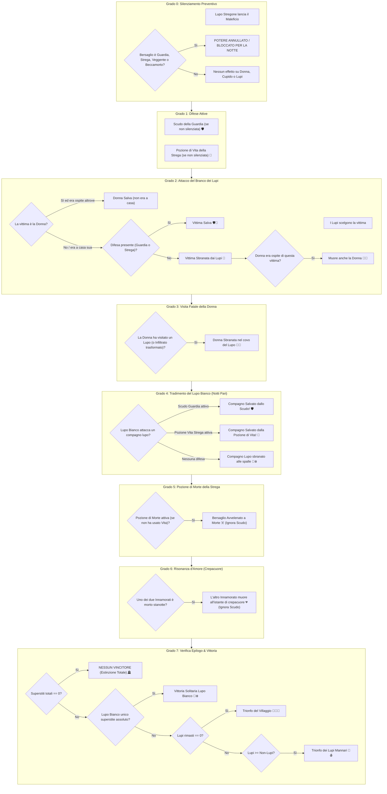

# 📜 Lupus in Fabula: Report Ufficiale delle Meccaniche di Gioco & Matrice dei Poteri

Questo documento costituisce il registro ufficiale e aggiornato di tutte le regole, priorità di risoluzione notturna, interazioni tra poteri e gestione dei casi limite implementate nel motore di gioco di *Lupus in Fabula*.

---

## 1. Regolamento Ufficiale Applicato sui Casi Limite

### 1. Pozione di Vita della Strega: Salva Sempre 🧪
* **Regola Ufficiale:** La Pozione di Vita della Strega è un elisir universale di salvezza contro qualsiasi aggressione fisica mortale della notte.
* **Esito nei casi limite:**
  * Se il bersaglio è attaccato dal **Branco dei Lupi** $\rightarrow$ **Salvo**.
  * Se il bersaglio (compagno lupo) viene attaccato alle spalle dal **Lupo Bianco** $\rightarrow$ **Salvo**.
* **Precedenza Scudo:** Se sia la Guardia che la Strega proteggono la stessa vittima, lo Scudo della Guardia ha la precedenza di intercettazione, ma la pozione della Strega viene comunque considerata consumata per la partita.

### 2. Guardia vs Crepacuore d'Amore: L'Innamorato muore comunque 💔
* **Regola Ufficiale:** Il legame di Cupido oltrepassa qualsiasi barriera fisica.
* **Esito:** Se un Innamorato perde la vita (notte o giorno) e l'altro era protetto dallo Scudo della Guardia, **l'Innamorato protetto muore comunque all'istante di crepacuore**.
* **Logica:** Lo scudo della Guardia ferma zanne, artigli e lame esterne, ma è totalmente impotente contro la rottura interiore del vincolo cardiaco e spirituale degli Innamorati.

### 3. Destino della Donna vs Pozione di Morte: La Donna muore ☠️
* **Regola Ufficiale:** L'assenza da casa salva la Donna solo ed esclusivamente dall'incursione fisica dei lupi mannari alla sua dimora.
* **Esito:** Se la Strega designa la Donna come bersaglio della Pozione di Morte mentre lei è rifugiata da un ospite, **la Donna muore avvelenata**.
* **Logica:** La pozione mortale della Strega è mirata direttamente alla persona, non all'edificio. Non esiste immunità magica per il fatto di aver trascorso la notte fuori casa.
* **Ospite che muore:**
  * Se l'ospite muore per **veleno della Strega** o **crepacuore** $\rightarrow$ **La Donna SOPRAVVIVE** (non c'è stato assalto dei lupi nella stanza).
  * Se l'ospite viene **sbranato dai Lupi** $\rightarrow$ **La Donna MUORE con lui**.

### 4. Paradosso della Coppia Mista rimasta sola (Lupo + Cittadino) ⏳
* **Stato Attuale:** **In sospeso per valutazioni future**.
* **Regola Transitoria:** Rimane valida la regola base: *non esiste condizione di vittoria della coppia e ciascuno appartiene alla propria fazione originaria*. Pertanto, se rimangono vivi solo un Lupo e un Cittadino innamorati, per formula numerica ($1 \ge 1$) scatta la vittoria della fazione Lupi. L'eventuale assegnazione di un trionfo esclusivo alla coppia o pareggio d'amore è congelata in attesa di nuove disposizioni.

### 5. Estinzione Totale (0 Superstiti): Scenario Alternativo "Nessuno Vince" 🪦
* **Regola Ufficiale:** Se durante la notte (per veleni, sbranamenti, tradimenti e crepacuore a catena) o al rogo muoiono contemporaneamente tutti i giocatori superstiti ($N_{vivi} = 0$), non viene proclamata la vittoria del Villaggio.
* **Esito:** **Nessun Vincitore (Estinzione Totale / Villaggio Fantasma)**.
* **Logica:** Il Male e il Bene si sono annientati a vicenda; il villaggio è una distesa di tombe e nessuno può reclamare il trionfo.

### 6. La Guardia protegge tutti (compreso il Lupo Bianco) 🛡️
* **Regola:** Lo scudo della Guardia è universale contro ogni assalto dei lupi mannari (sia del Branco che del Lupo Bianco).
* **Esito:** Se la Guardia difende il compagno lupo aggredito dal Lupo Bianco, il compagno è salvo.

### 7. Strega: Massimo 1 Pozione per Notte 🧪/☠️
* **Regola:** La Strega possiede 2 pozioni per l'intera partita (1 Vita, 1 Morte), ma può utilizzarne **al massimo UNA per notte**. L'attivazione di una disabilita automaticamente l'altra per quel round.

---

## 2. Ordine di Priorità Assoluto di Oggetti, Ruoli e Azioni

Nel motore di gioco, le azioni e gli oggetti vengono risolti secondo la seguente gerarchia rigorosa e sequenziale:

---

## 3. Matrice Completa degli Scontri: "Chi Vince?"

| Scontro Diretto | Potere A | Potere B | Chi Vince? | Esito Ufficiale nel Motore di Gioco |
| :--- | :--- | :--- | :---: | :--- |
| **Strega (Vita) vs Lupi del Branco** | Pozione Vita | Attacco Branco | **Strega** 🧪 | Bersaglio **Salvo**. Pozione consumata. |
| **Strega (Vita) vs Lupo Bianco** | Pozione Vita | Morso Traditore | **Strega** 🧪 | Bersaglio **Salvo**. La Pozione di Vita salva sempre da attacchi mortali fisici. |
| **Guardia vs Lupi del Branco** | Scudo Guardia | Attacco Branco | **Guardia** 🛡️ | Bersaglio **Salvo**. Nessun caduto tra i contadini. |
| **Guardia vs Lupo Bianco** | Scudo Guardia | Morso alle Spalle | **Guardia** 🛡️ | **Salvo!** Lo scudo difende il compagno lupo dal tradimento del Lupo Bianco. |
| **Guardia vs Strega (Morte)** | Scudo Guardia | Pozione Morte | **Strega** ☠️ | Bersaglio **Muore avvelenato**. Lo scudo ferma solo aggressioni fisiche, non veleno magico. |
| **Guardia vs Crepacuore Innamorati** | Scudo Guardia | Crepacuore | **Crepacuore** 💔 | L'innamorato **Muore comunque**. Il legame vitale trapassa qualsiasi scudo protettivo. |
| **Strega (Morte) vs Donna ospite altrove** | Pozione Morte | Assenza da Casa | **Strega** ☠️ | **Donna Muore avvelenata**. Dormire altrove ripara dai lupi ma non dal veleno mirato. |
| **Strega (Vita) vs Strega (Morte)** | Pozione Vita | Pozione Morte | **Mutua Esclusione** ⚖️ | **Impossibile nello stesso turno**. La Strega può attivare solo 1 pozione a notte. |
| **Guardia + Strega (Vita) su stessa vittima** | Scudo Guardia | Pozione Vita | **Guardia** 🛡️ | Bersaglio Salvo; la Guardia para per prima, la Strega consuma ugualmente la pozione. |
| **Lupo Stregone vs Guardia / Strega** | Silenziamento | Scudo / Pozioni | **Lupo Stregone** 🔮 | Potere **bloccato** per l'intera notte. Nessuna difesa o veleno ha effetto. |
| **Lupo Stregone vs Veggente / Beccamorto**| Silenziamento | Visione / Consulto | **Lupo Stregone** 🔮 | Vista e consulto **oscurati** per quella notte. |
| **Lupo Stregone vs Donna** | Silenziamento | Rifugio Donna | **Donna** 💃 | Nessun effetto. La Donna può rifugiarsi normalmente. |
| **Lupi attaccano Donna a casa sua** | Attacco Lupi | Assenza da Casa | **Donna** 💃 | **Donna Salva**. I lupi trovano la casa vuota (era rifugiata da un innocente). |
| **Donna visita un Lupo qualsiasi** | Rifugio Donna | Presenza Lupo | **Lupi** 🐺 | **Donna Muore sbranata** nella tana del Lupo. |
| **Donna visita Mannaro non trasformato** | Rifugio Donna | Mannaro Latente | **Donna** 💃 | **Donna Salva**. Dorme sonni tranquilli. |
| **Donna visita Mannaro trasformato** | Rifugio Donna | Mannaro Sveglio | **Lupi** 🐺 | **Donna Muore sbranata**. |
| **Lupi attaccano ospite della Donna** | Attacco Lupi | Rifugio Donna | **Lupi** 🐺 | **Muoiono sia l'Ospite che la Donna**. |
| **Lupi attaccano ospite difeso da Guardia** | Scudo Guardia | Attacco Lupi | **Guardia** 🛡️ | **Salvi sia l'Ospite che la Donna**. |
| **Ospite muore di Crepacuore o Veleno** | Crepacuore / Veleno | Rifugio Donna | **Donna** 💃 | **La Donna Sopravvive**. Nessun lupo ha fatto irruzione nella stanza. |
| **Veggente vs Cane Nero** | Visione Mistica | Mascheramento | **Cane Nero** 🐕‍🦺 | Responso: **NON LUPO**. |
| **Veggente vs Idiota del Villaggio** | Visione Mistica | Pazzia Apparente | **Idiota** 🤡 | Responso: **LUPO** (falso positivo innocente). |
| **Giullare al Rogo (Giorno)** | Rogo Villaggio | Obiettivo Caos | **Giullare** 🃏 | **Partita vinta all'istante dal Giullare**. |
| **Giullare ucciso di Notte** | Attacco Notte | Giullare | **Attaccante** 🐺☠️ | Giullare **Eliminato** senza vincere. |
| **Estinzione Totale (0 superstiti vivi)** | Notte / Rogo | Sopravvivenza | **Nessuno** 🪦 | **Nessun Vincitore!** Villaggio deserto, pareggio per distruzione reciproca. |
| **Coppia Mista (Lupo + Umano) rimasta sola**| Vincolo Amoroso | Regole Fazione | **In Sospeso** ⏳ | Congelata per future revisioni (attualmente conteggiata come vittoria Lupi per formula). |

---

## 4. File Sorgente Collegati

- [lupus_night_resolver.js](file:///c:/Users/simop/Documents/GitHub/nuovoprogetto/js/games/lupus/lupus_night_resolver.js): Risoluzione notturna gerarchica all'Alba (Pozione Vita universale, scudo Guardia, trappole della Donna, crepacuore).
- [lupus_night_widgets.js](file:///c:/Users/simop/Documents/GitHub/nuovoprogetto/js/games/lupus/lupus_night_widgets.js): Interfaccia grafica con mutua esclusione per le pozioni della Strega e accoppiamento di Cupido.
- [lupus_master_ui.js](file:///c:/Users/simop/Documents/GitHub/nuovoprogetto/js/games/lupus/lupus_master_ui.js): Gestione del rogo diurno, crepacuore a catena ed epilogo a fine partita (compreso scenario Estinzione Totale).
- [lupus_roles.js](file:///c:/Users/simop/Documents/GitHub/nuovoprogetto/js/games/lupus/lupus_roles.js): Definizioni canoniche delle carte ruolo.
- [lupus_game.js](file:///c:/Users/simop/Documents/GitHub/nuovoprogetto/js/games/lupus_game.js): Controller di gioco e verifica condizioni di vittoria (Lupo Bianco, Villaggio, Lupi, Giullare e Nessun Vincitore).
