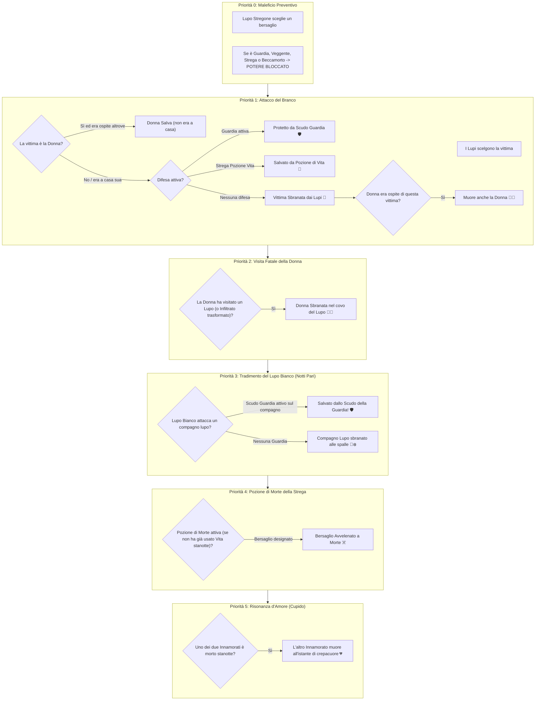

# 📜 Lupus in Fabula: Report Ufficiale delle Meccaniche di Gioco & Matrice dei Poteri

Questo documento costituisce il registro ufficiale e aggiornato di tutte le regole, priorità di risoluzione notturna e interazioni tra poteri implementate nel motore di gioco di *Lupus in Fabula*.

---

## 1. Regolamento Ufficiale Applicato sui Casi Limite

### 1. La Guardia protegge tutti (compreso il Lupo Bianco) 🛡️
* **Regola:** Lo scudo della Guardia è universale contro ogni forma di assalto dei lupi mannari.
* **Esito:** Se la Guardia sceglie di proteggere un giocatore (sia esso contadino o lupo) e quella notte il **Lupo Bianco** decide di sbranarlo alle spalle, **lo scudo della Guardia intercetta l'attacco e salva la vittima**.
* **Logica:** Premia l'intuizione o la fortuna della Guardia; la protezione fisica copre sia l'attacco del branco sia il tradimento solitario del Lupo Bianco. Resta invece inefficace contro il veleno della Strega.

### 2. Destino della Donna (Regola Narrativa Classica) 💃
* **Regola:** La Donna muore insieme al suo ospite **SOLO ed ESCLUSIVAMENTE se l'ospite viene sbranato fisicamente dai Lupi**.
* **Esito nei casi limite:**
  * Se l'ospite muore per **crepacuore d'amore** (il suo partner innamorato è morto altrove) $\rightarrow$ **La Donna SOPRAVVIVE**.
  * Se l'ospite muore per **veleno della Strega** $\rightarrow$ **La Donna SOPRAVVIVE**.
* **Logica:** I Lupi non hanno violato la dimora in cui si trova la Donna; la morte interiore da crepacuore o l'ingestione di una pozione velenosa non coinvolge fisicamente la Donna, che può allontanarsi illesa all'Alba.

### 3. Regola degli Innamorati (Cupido): Muoiono semplicemente insieme 💘
* **Regola:** **Non esiste alcuna condizione di vittoria della coppia**. Gli Innamorati non costituiscono una terza fazione e non hanno un trionfo autonomo a due.
* **Fazione di Appartenenza:** Ciascun innamorato conserva esclusivamente l'obiettivo di vittoria della propria fazione originaria (Villaggio o Lupi).
* **Vincolo Vitale Tragico:** Il legame scoccato dalle frecce di Cupido opera unicamente come vincolo di morte simbiotico: se uno dei due amanti perde la vita (sbranato dai lupi, arso al rogo, avvelenato dalla Strega o ucciso dal Lupo Bianco), l'altro **muore all'istante di crepacuore**.

### 4. Strega: Massimo 1 Pozione per Notte 🧪/☠️
* **Regola:** La Strega possiede 2 pozioni per l'intera partita (1 Vita, 1 Morte), ma può utilizzarne **AL MASSIMO UNA per notte**.
* **Esito:** Non è possibile usare sia la Pozione di Vita che la Pozione di Morte nello stesso round.
* **Prevenzione dell'Assurdo:** Selezionando un bersaglio per la Pozione di Vita, la Pozione di Morte viene automaticamente azzerata e disattivata per quel turno (e viceversa). Questo impedisce alla radice la contraddizione logica di somministrare vita e morte contemporaneamente allo stesso giocatore o di effettuare due azioni magiche nella stessa notte.

---

## 2. Pipeline di Risoluzione Notturna (Ordine di Priorità a 6 Livelli)

All'Alba, gli eventi registrati dal Narratore vengono risolti sequenzialmente secondo la seguente gerarchia rigorosa:

---

## 3. Matrice Completa degli Scontri: "Chi Vince?"

| Scontro Diretto | Potere A | Potere B | Chi Vince? | Esito Ufficiale nel Motore di Gioco |
| :--- | :--- | :--- | :---: | :--- |
| **Guardia vs Lupi del Branco** | Scudo Guardia | Attacco Branco | **Guardia** 🛡️ | Bersaglio **Salvo**. Nessun caduto tra i contadini. |
| **Guardia vs Lupo Bianco** | Scudo Guardia | Morso alle Spalle | **Guardia** 🛡️ | **Salvo!** Lo scudo difende il compagno lupo dal tradimento del Lupo Bianco. |
| **Guardia vs Strega (Morte)** | Scudo Guardia | Pozione Morte | **Strega** ☠️ | Bersaglio **Muore avvelenato**. Lo scudo ferma solo zanne fisiche, non il veleno. |
| **Strega (Vita) vs Lupi** | Pozione Vita | Attacco Branco | **Strega** 🧪 | Bersaglio **Salvo**. Pozione di Vita consumata per la partita. |
| **Strega (Vita) vs Strega (Morte)** | Pozione Vita | Pozione Morte | **Mutua Esclusione** ⚖️ | **Impossibile**. La Strega può attivare solo 1 pozione a notte (l'interfaccia blocca l'altra). |
| **Guardia + Strega (Vita) su stessa vittima** | Scudo Guardia | Pozione Vita | **Guardia** 🛡️ | Bersaglio Salvo, ma la Strega spreca la pozione (entrambe le difese erano attive). |
| **Lupo Stregone vs Guardia** | Silenziamento | Scudo Guardia | **Lupo Stregone** 🔮 | Scudo **annullato**. La Guardia non protegge nessuno per quella notte. |
| **Lupo Stregone vs Veggente** | Silenziamento | Visione Veggente | **Lupo Stregone** 🔮 | Veggente **non riceve risposta** (vista mistica oscurata). |
| **Lupo Stregone vs Strega** | Silenziamento | Pozioni Strega | **Lupo Stregone** 🔮 | Entrambe le pozioni (Vita/Morte) sono **bloccate** per quella notte. |
| **Lupo Stregone vs Beccamorto** | Silenziamento | Consulto Morti | **Lupo Stregone** 🔮 | Il Beccamorto non scopre l'identità del defunto. |
| **Lupo Stregone vs Donna** | Silenziamento | Rifugio Donna | **Donna** 💃 | Il Lupo Stregone **non ha effetto sulla Donna** (può rifugiarsi normalmente). |
| **Lupi attaccano Donna a casa sua** | Attacco Lupi | Assenza da Casa | **Donna** 💃 | **Donna Salva**. I lupi trovano la casa vuota (era rifugiata altrove). |
| **Donna visita un Lupo qualsiasi** | Rifugio Donna | Presenza Lupo | **Lupi** 🐺 | **Donna Muore sbranata**. (Anche se i lupi avevano mirato un'altra vittima). |
| **Donna visita Mannaro non trasformato** | Rifugio Donna | Mannaro Latente | **Donna** 💃 | **Donna Salva**. Il mannaro dorme sonni umani. |
| **Donna visita Mannaro appena trasformato** | Rifugio Donna | Mannaro Sveglio | **Lupi** 🐺 | **Donna Muore sbranata** (trasformatosi al passo precedente 3b). |
| **Lupi attaccano ospite della Donna** | Attacco Lupi | Rifugio Donna | **Lupi** 🐺 | **Muoiono sia l'Ospite che la Donna**. |
| **Lupi attaccano ospite protetto da Guardia** | Scudo Guardia | Attacco Lupi | **Guardia** 🛡️ | **Salvi sia l'Ospite che la Donna**. |
| **Ospite della Donna muore di Crepacuore** | Crepacuore | Rifugio Donna | **Donna** 💃 | **La Donna Sopravvive**. Non c'è stato assalto dei lupi nella stanza. |
| **Ospite della Donna muore Avvelenato** | Pozione Morte | Rifugio Donna | **Donna** 💃 | **La Donna Sopravvive**. L'ospite muore per veleno, la Donna fugge illesa. |
| **Veggente vs Cane Nero** | Visione Mistica | Mascheramento | **Cane Nero** 🐕‍🦺 | Risposta: **NON LUPO**. |
| **Veggente vs Idiota del Villaggio** | Visione Mistica | Pazzia Apparente | **Idiota** 🤡 | Risposta: **LUPO** (falso positivo, ma è innocente). |
| **Veggente vs Lupo Mannaro** | Visione Mistica | Licantropia | **Dinamico** 🌓 | Prima della trasformazione: **NON LUPO**. Dopo la luna piena: **LUPO**. |
| **Innamorati vs Qualsiasi Morte** | Crepacuore | Fazione Originale | **Nessuna Vittoria di Coppia** 💔 | **Muoiono semplicemente insieme**. Ciascuno appartiene alla propria fazione; se uno muore per qualsiasi causa (Lupi, Rogo, Veleno), l'altro muore subito di crepacuore. |
| **Giullare al Rogo (Giorno)** | Rogo Villaggio | Vittoria Giullare | **Giullare** 🃏 | **Partita vinta all'istante dal Giullare**. |
| **Giullare sbranato o avvelenato (Notte)** | Attacco Notte | Giullare | **Attaccante** 🐺☠️ | Giullare **Eliminato** senza vincere. |

---

## 4. File Sorgente Collegati

- [lupus_night_resolver.js](file:///c:/Users/simop/Documents/GitHub/nuovoprogetto/js/games/lupus/lupus_night_resolver.js): Risoluzione eventi notturni all'Alba, scudo Guardia contro Lupo Bianco e vincoli di morte a catena.
- [lupus_night_widgets.js](file:///c:/Users/simop/Documents/GitHub/nuovoprogetto/js/games/lupus/lupus_night_widgets.js): Interfaccia grafica con mutua esclusione per le pozioni della Strega e selezione innamorati.
- [lupus_master_ui.js](file:///c:/Users/simop/Documents/GitHub/nuovoprogetto/js/games/lupus/lupus_master_ui.js): Convalida del pulsante Avanti e gestione del rogo con crepacuore immediato.
- [lupus_roles.js](file:///c:/Users/simop/Documents/GitHub/nuovoprogetto/js/games/lupus/lupus_roles.js): Definizioni canoniche dei ruoli (Cupido: nessun trionfo di coppia, semplice destino comune).
- [lupus_game.js](file:///c:/Users/simop/Documents/GitHub/nuovoprogetto/js/games/lupus_game.js): Controller principale, istruzioni narratore e condizioni di vittoria standard (Villaggio, Lupi, Giullare, Lupo Bianco).
